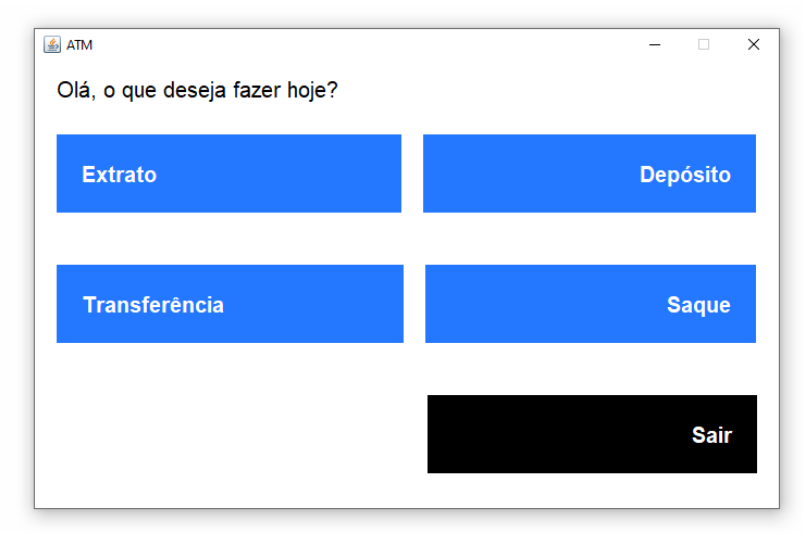

# Bank

This is a college work to develop a project using Java with Swing and JDBC.

Our goal was to develop a highly maintainable and read-easy code with the use of a micro framework created to help handling database manipulations and window management.
 Mostly of our code structure (`core`  package) was inspired by Spring Framework.

This project can be resumed as an bank interface where users can deposit, withdraw, transfer to other users, see and generate bank statements PDFs.

<p align="center">
  
</p>

## Get started

In order to run this project, you will have to connect to a database (configurable in database.yaml).
We recommend Docker to set up the database with ease, you'll have to just run the commands below.

### Docker
Download MySQL image from docker hub
```bash
docker pull mysql
```

Run a container
```bash
docker run -d -p 3306:3306 -e MYSQL_ROOT_PASSWORD=root -e MYSQL_DATABASE=banco -e MYSQL_USER=root -e MYSQL_PASSWORD=root --name bankdb mysql
```

### Remote database
If you want to connect to a cloud, you can change the credentials in `database.yaml`


## After setting up database
Execute it with Maven or an IDE of your preference.

### Maven
```bash 
mvn clean install
mvn exec:java -Dexec.mainClass="br.unesp.banco.Main"
```

### IDE
Run class `br.unesp.banco.Main`

## Do you want to know more about this project?
Read [this doc](https://docs.google.com/document/d/1sC_w8kpSBZUoDh3RFgNcpUPe031ZHfjgF4UuoFB_DKg).


